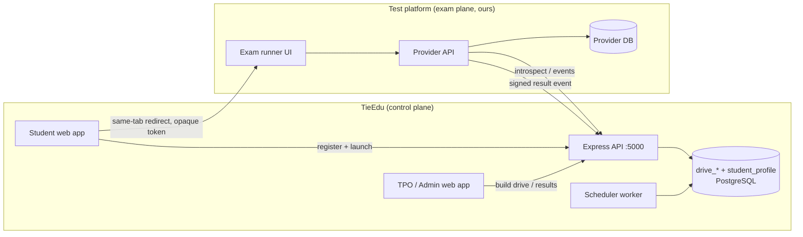
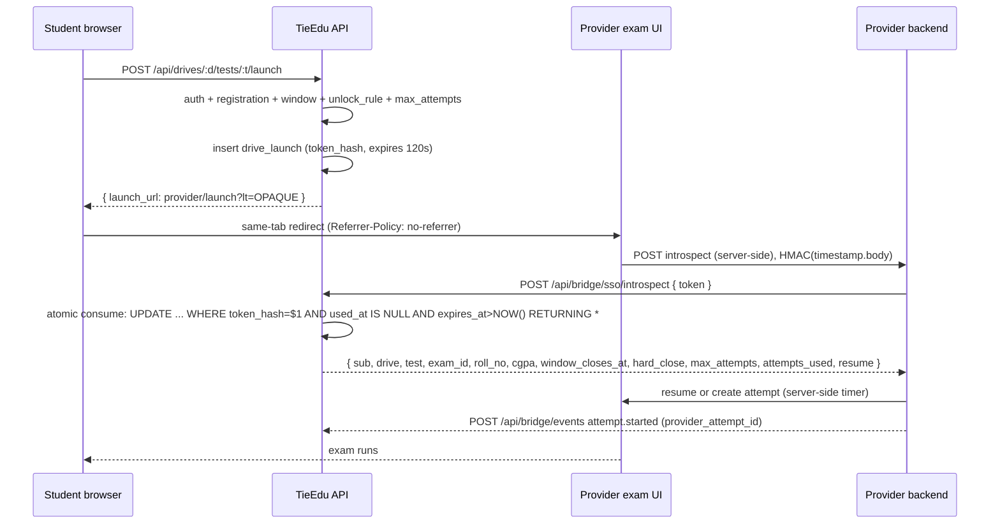

# TieEdu — Mock Drive & Assessment Bridge Plan (v2, Superset-style)

> **v2 changelog:** This version closes 26 review gaps from the v1 audit. Biggest changes:
> **(a)** launch token is now an **opaque random token** (hashed at rest), not a JWT/JWKS — `introspect` is authoritative because both platforms are ours; **(b)** new **`student_profile`** + verification (eligibility had no data source); **(c)** new **`drive_registration_test`** for per-round status (v1 marked the whole drive "completed" after the first test — bug); **(d)** **attempt counting** moved off launches onto real provider attempts; **(e)** **resume**, **round gating**, **results visibility**, **scheduler**, **notifications**, **invites**, **replay-proof timestamped HMAC**, **separate introspect/webhook secrets**; **(f)** same-tab redirect (popup blocker); **(g)** internal results also written to `drive_attempt`.
> See the [Gap Closure Matrix](#gap-closure-matrix) for item-by-item.

> **Decisions locked (owner):**
> 1. **Two platforms, one identity.** TieEdu = registration + drive/company mapping + student identity (**TieEdu ID**). The **other platform** (also ours) = exam runtime.
> 2. **Handoff = one-click SSO, same tab.** Student never re-types credentials. TieEdu issues a short-lived **opaque** launch token → provider consumes it via `introspect` → student lands signed in on the right exam.
> 3. **Results come back to TieEdu** via a signed, timestamped webhook. TieEdu is the single source of dashboards.
> 4. **Storage = PostgreSQL** (same CockroachDB cluster as Placement), tables prefixed `drive_`. No JSON fallback — PG down ⇒ **503**, exactly like `placement_*` (`backend/src/routes/placement.routes.ts:9-21`).
> 5. **MVP has no round gating** (one external test per drive first). Gating is Phase 4.

Goal (plain): Student TieEdu pe TieEdu ID se register karta hai → profile verify hoti hai → drive me **one-click register** → ek click me doosre portal pe **already-logged-in** test deta hai → score wapas TieEdu pe aata hai → shortlist hone pe next round unlock.

---

## Table of Contents
1. [Student Journey (short)](#1-student-journey-short)
2. [Problem & Product Framing](#2-problem--product-framing)
3. [Current State Audit](#3-current-state-audit)
4. [Target Architecture](#4-target-architecture)
5. [Core Concepts & Vocabulary](#5-core-concepts--vocabulary)
6. [Student Profile & Verification](#6-student-profile--verification)
7. [Database Schema (`drive_*` + `student_profile`)](#7-database-schema)
8. [Identity Model](#8-identity-model)
9. [SSO Launch Handoff (opaque token)](#9-sso-launch-handoff)
10. [Result & Lifecycle Events](#10-result--lifecycle-events)
11. [Provider Contract (frozen)](#11-provider-contract)
12. [Round Progression & Shortlisting](#12-round-progression--shortlisting)
13. [Results Visibility](#13-results-visibility)
14. [Attempt Counting](#14-attempt-counting)
15. [Scheduling & Background Jobs](#15-scheduling--background-jobs)
16. [Notifications](#16-notifications)
17. [Internal Mode (built-in skill-test)](#17-internal-mode)
18. [Backend API — Student](#18-backend-api--student)
19. [Backend API — Admin / TPO](#19-backend-api--admin--tpo)
20. [Backend API — Bridge](#20-backend-api--bridge)
21. [Frontend — Student](#21-frontend--student)
22. [Frontend — Admin & TPO](#22-frontend--admin--tpo)
23. [RBAC, Security & PII](#23-rbac-security--pii)
24. [Failure Handling & Edge Cases](#24-failure-handling--edge-cases)
25. [MVP Definition](#25-mvp-definition)
26. [Revised Roadmap](#26-revised-roadmap)
27. [Files to Touch](#27-files-to-touch)
28. [Open Decisions](#28-open-decisions)
29. [Gap Closure Matrix](#gap-closure-matrix)

---

## 1. Student Journey (short)

1. **Signup / login** on TieEdu → student gets a **TieEdu ID** (`user.id`, display `LIC-…` / `ROLL-…`).
2. **One-time profile + verification** — branch, batch, CGPA, backlogs, and their **real college roll number**. TPO verifies it (or imports a CSV). No verified profile ⇒ drives won't match.
3. **"Mock Drives" page** → only drives matching eligibility show up. **Register** = one click.
4. **On drive day** → open the drive, see the tests/rounds. Click **Start Test**.
5. TieEdu hands back a **one-time link** → student travels to the exam portal **in the same tab**, **already logged in**.
6. **Takes the test.** If the tab closes or they leave, **Continue** resumes the **same** attempt (timer runs server-side).
7. **Submit** → score flows back to TieEdu. Student sees the **result when TPO publishes**, and if **shortlisted**, the **next round unlocks**.

---

## 2. Problem & Product Framing

A company mock drive = company decides rounds (Aptitude → Coding → Technical MCQ); students must register, get to the right exam, and results must land in one place. Today that is manual and split across systems. TieEdu owns the student relationship (identity, TieEdu ID, roll mapping, TPO portal); the **test platform** owns the exam runtime (questions, timer, scoring, proctoring).

**The bridge makes TieEdu the control plane and the test platform the exam plane.**

| Concern | Owned by |
|---|---|
| Student identity, TieEdu ID, verified profile, roll no | **TieEdu** |
| Company + mock drive definition, schedule, eligibility | **TieEdu** |
| Which tests belong to which drive; round gating | **TieEdu** |
| Exam runtime, timer, scoring, proctoring | **Test platform** |
| Results, analytics, TPO/student dashboards | **TieEdu** (mirror) |

Non-goals (v1/MVP): full proctoring engine inside TieEdu; multi-provider at once (schema is multi-provider, we ship **one**); round gating before Phase 4.

---

## 3. Current State Audit

| Area | What exists | Reuse / gap |
|---|---|---|
| Student identity | `User { id, name, email, role, roll_no?, license_id?, college? }` — `backend/src/data/db.ts:80`. JWT = `{ sub, role }`. | ✅ `user.id` = external key. ❌ **No branch/CGPA/batch** → eligibility impossible today (Gap 1). |
| Derived IDs | `license_id` / `roll_no` = `ROLL-xxxxxx` derived from `user.id` — `middleware/auth.ts:93-94`. | 🚩 These are **display IDs, not real college roll numbers** (Gap 2). |
| Placement / TPO | `placement_*` tables; roles/permissions `backend/src/placement/permissions.ts:21`; PG-only `middleware/placementAuth.ts`. | ✅ Reuse realm, roles, audit, 503. |
| Company drives | `placement_drive` = a **real** company visit with company-*reported* counts — `db/placementMigrate.ts:271`. | ⚠️ Different thing. We add `mock_drive`. |
| Student↔account link | `placement_student_link(college_id, roll_no, user_id)` — `placementMigrate.ts:124`. | 🚩 **No write path exists** (read-only at `placement.routes.ts:309`). We populate it on verified registration. |
| Skill-test engine | `skills/topics/questions/assessments/attempts` in `db.json` (`skillTestTypes.ts`, `routes/skill-test.routes.ts`). | ✅ **Internal mode**; but attempts don't know their drive (Gap 16). |
| Webhook security | Razorpay HMAC over raw body; `req.rawBody` stashed by global `express.json({ verify })` — `server.ts:66-69`, `webhooks.routes.ts:17-20`. | ✅ **Reuse `req.rawBody`** (do NOT mount a second body parser — Gap 22). |
| API-key / SSO realm | **None.** | ❌ Build bridge auth. |
| CSV import | `placement/glaImport.ts` + `scripts/glaImportCli.ts`. | ✅ Reuse shape for student-profile + roster import. |

**Readiness:** SSO/webhook protocol ~85% (design), data model ~60%, Superset-like product experience ~50%. This v2 targets the missing 40%.

---

## 4. Target Architecture



Two systems talk over exactly three surfaces:

1. `POST /api/bridge/sso/introspect` — provider validates + **atomically consumes** a launch token.
2. `POST /api/bridge/events` — provider pushes signed lifecycle events (`attempt.started` / `attempt.completed` / `attempt.aborted`).
3. (Optional) `POST /api/bridge/sso/ack` — provider returns its `candidate_id` after start; and `GET /api/bridge/drives/:id/roster` for pre-provisioning.

No JWKS (opaque tokens make it unnecessary). No third body parser (`req.rawBody` already exists).

---

## 5. Core Concepts & Vocabulary

| Term | Meaning | Table |
|---|---|---|
| **Student Profile** | Verified academic facts (branch, batch, CGPA, backlogs, real roll no). | `student_profile` |
| **Provider** | A test platform we integrate with (ours). | `drive_provider` |
| **Test** | One exam/quiz. `external` (provider) or `internal` (skill-test). | `drive_test` |
| **Mock Drive** | A campaign: company + window + eligibility + 1..n tests. | `mock_drive` |
| **Drive Test** | Ordered link drive↔test (+ unlock rule, weight, attempts). | `mock_drive_test` |
| **Registration** | Student enrolled in a drive (immutable key = `user_id`). | `drive_registration` |
| **Registration Test** | Per-test (per-round) status for one registration. | `drive_registration_test` |
| **Invite** | Pre-account invite for roster mode. | `drive_invite` |
| **Launch** | One-time opaque token so a student can open a test. | `drive_launch` |
| **Attempt / Result** | Mirrored attempt from provider (or `internal`). | `drive_attempt` |
| **Event** | Raw inbound callback (idempotency + audit + parking lot). | `drive_webhook_event` |
| **Notification** | Outbox row for drive lifecycle messages. | `drive_notification` |

---

## 6. Student Profile & Verification

**Why:** v1's `eligibility: { branches[], min_cpi, batches[] }` had nothing to check against — `User` has no branch/CGPA/batch. This is the Superset USP and must ship **before** registration filtering.

`student_profile` (PG, keyed by `user_id`, scoped by `college_id`):

```
user_id      TEXT NOT NULL,
college_id   TEXT NOT NULL,
roll_no      TEXT NOT NULL,        -- the REAL college roll number (not ROLL-xxxxxx)
branch       TEXT,
batch        TEXT,                 -- e.g. '2026'
degree       TEXT,
cgpa         NUMERIC(4,2),
class10_pct  NUMERIC(6,2),
class12_pct  NUMERIC(6,2),
backlogs     INT NOT NULL DEFAULT 0,
status       TEXT NOT NULL DEFAULT 'self_declared',  -- self_declared|pending|verified|rejected
verified_by  TEXT,
verified_at  TIMESTAMPTZ,
source       TEXT NOT NULL DEFAULT 'self',           -- self|tpo_csv|tpo_manual
created_at   TIMESTAMPTZ NOT NULL DEFAULT NOW(),
updated_at   TIMESTAMPTZ NOT NULL DEFAULT NOW(),
PRIMARY KEY (user_id, college_id)
```

Rules:
- **Self-declare digest:** student fills branch/batch/CGPA/roll on first registration; `status='self_declared'`.
- **TPO verify:** TPO bulk-imports (CSV, `glaImport` shape) or verifies individual → `status='verified'`, `verified_by`, `verified_at`.
- **Gate:** a drive with `eligibility.require_verified=true` only accepts `verified` profiles.
- **`verified_by`** is the TPO user id/email (audit trail).
- **Real roll number** is captured here (Gap 2); `ROLL-xxxxxx` remains display-only.
- cgpa/batch are numeric/string as imported; the importer validates ranges (mirroring `placement_student_season` CHECKs).

---

## 7. Database Schema

New migration file **`backend/src/db/driveBridgeMigrate.ts`**, modelled on `placementMigrate.ts` (idempotent `CREATE TABLE IF NOT EXISTS`, `gen_random_uuid()::TEXT`, no `SERIAL`, no generated columns, `TIMESTAMPTZ`). Tables in this section replace v1's set and add the new ones.

### 7.1 Student profile

```sql
CREATE TABLE IF NOT EXISTS student_profile (
  user_id      TEXT NOT NULL,
  college_id   TEXT NOT NULL,
  roll_no      TEXT NOT NULL,
  branch       TEXT,
  batch        TEXT,
  degree       TEXT,
  cgpa         NUMERIC(4,2),
  class10_pct  NUMERIC(6,2),
  class12_pct  NUMERIC(6,2),
  backlogs     INT NOT NULL DEFAULT 0,
  status       TEXT NOT NULL DEFAULT 'self_declared',
  verified_by  TEXT,
  verified_at  TIMESTAMPTZ,
  source       TEXT NOT NULL DEFAULT 'self',
  created_at   TIMESTAMPTZ NOT NULL DEFAULT NOW(),
  updated_at   TIMESTAMPTZ NOT NULL DEFAULT NOW(),
  PRIMARY KEY (user_id, college_id),
  CONSTRAINT student_profile_status_valid
    CHECK (status IN ('self_declared','pending','verified','rejected')),
  CONSTRAINT student_profile_source_valid
    CHECK (source IN ('self','tpo_csv','tpo_manual')),
  CONSTRAINT student_profile_cgpa_range CHECK (cgpa IS NULL OR (cgpa >= 0 AND cgpa <= 10))
);
CREATE INDEX IF NOT EXISTS student_profile_roll_idx ON student_profile(college_id, roll_no);
CREATE INDEX IF NOT EXISTS student_profile_status_idx ON student_profile(college_id, status);
```

### 7.2 Provider & test catalog

```sql
CREATE TABLE IF NOT EXISTS drive_provider (
  provider_id        TEXT PRIMARY KEY DEFAULT gen_random_uuid()::TEXT,
  code               TEXT NOT NULL UNIQUE,           -- 'acme-exam'
  name               TEXT NOT NULL,
  base_url           TEXT NOT NULL,
  launch_url         TEXT NOT NULL,
  introspect_url     TEXT NOT NULL DEFAULT '',
  secret_env_prefix  TEXT NOT NULL,                  -- 'BRIDGE_ACME' -> *_INTROSPECT_SECRET / *_WEBHOOK_SECRET / *_API_SECRET
  status             TEXT NOT NULL DEFAULT 'active',
  created_at         TIMESTAMPTZ NOT NULL DEFAULT NOW(),
  updated_at         TIMESTAMPTZ NOT NULL DEFAULT NOW(),
  CONSTRAINT drive_provider_status_valid CHECK (status IN ('active','disabled'))
);

CREATE TABLE IF NOT EXISTS drive_test (
  test_id            TEXT PRIMARY KEY DEFAULT gen_random_uuid()::TEXT,
  provider_id        TEXT REFERENCES drive_provider(provider_id) ON DELETE RESTRICT,
  mode               TEXT NOT NULL DEFAULT 'external',  -- 'external'|'internal'
  name               TEXT NOT NULL,
  slug               TEXT NOT NULL UNIQUE,
  provider_exam_id   TEXT,
  skill_slug         TEXT,
  duration_minutes   INT,
  total_questions    INT,
  provider_meta      JSONB NOT NULL DEFAULT '{}',
  status             TEXT NOT NULL DEFAULT 'active',
  created_at         TIMESTAMPTZ NOT NULL DEFAULT NOW(),
  updated_at         TIMESTAMPTZ NOT NULL DEFAULT NOW(),
  CONSTRAINT drive_test_mode_valid CHECK (mode IN ('external','internal')),
  CONSTRAINT drive_test_external_ref CHECK (
    mode <> 'external' OR (provider_id IS NOT NULL AND provider_exam_id IS NOT NULL)),
  CONSTRAINT drive_test_internal_ref CHECK (
    mode <> 'internal' OR skill_slug IS NOT NULL)
);
CREATE INDEX IF NOT EXISTS drive_test_provider_idx ON drive_test(provider_id);
```

### 7.3 Mock drive, tests, results visibility

```sql
CREATE TABLE IF NOT EXISTS mock_drive (
  drive_id          TEXT PRIMARY KEY DEFAULT gen_random_uuid()::TEXT,
  college_id        TEXT,                                -- NULL = open/cross-college
  company_id        TEXT,
  company_name      TEXT NOT NULL DEFAULT '',
  title             TEXT NOT NULL,
  description       TEXT NOT NULL DEFAULT '',
  drive_type        TEXT NOT NULL DEFAULT 'mock',
  season_id         TEXT,
  starts_at         TIMESTAMPTZ,
  ends_at           TIMESTAMPTZ,
  eligibility       JSONB NOT NULL DEFAULT '{}',         -- { branches[], min_cpi, min_cgpa, batches[], max_backlogs, require_verified }
  registration_mode TEXT NOT NULL DEFAULT 'open',        -- 'open'|'roster'|'invite'
  results_visibility TEXT NOT NULL DEFAULT 'after_close', -- 'immediate'|'after_close'|'manual'   (Gap 8)
  status            TEXT NOT NULL DEFAULT 'draft',       -- 'draft'|'published'|'live'|'closed'|'archived'
  created_by        TEXT,
  created_at        TIMESTAMPTZ NOT NULL DEFAULT NOW(),
  updated_at        TIMESTAMPTZ NOT NULL DEFAULT NOW(),
  CONSTRAINT mock_drive_reg_valid CHECK (registration_mode IN ('open','roster','invite')),
  CONSTRAINT mock_drive_rv_valid  CHECK (results_visibility IN ('immediate','after_close','manual')),
  CONSTRAINT mock_drive_status_valid CHECK (status IN ('draft','published','live','closed','archived'))
);
CREATE INDEX IF NOT EXISTS mock_drive_college_idx ON mock_drive(college_id, status);
CREATE INDEX IF NOT EXISTS mock_drive_window_idx  ON mock_drive(starts_at, ends_at);

CREATE TABLE IF NOT EXISTS mock_drive_test (
  drive_id       TEXT NOT NULL REFERENCES mock_drive(drive_id) ON DELETE CASCADE,
  test_id        TEXT NOT NULL REFERENCES drive_test(test_id) ON DELETE RESTRICT,
  sort_order     INT NOT NULL DEFAULT 1,
  mandatory      BOOLEAN NOT NULL DEFAULT TRUE,
  weight         NUMERIC(6,3) NOT NULL DEFAULT 1,
  max_attempts   INT NOT NULL DEFAULT 1,
  opens_at       TIMESTAMPTZ,
  closes_at      TIMESTAMPTZ,
  window_hard_close BOOLEAN NOT NULL DEFAULT TRUE,        -- Gap 11
  unlock_rule    JSONB NOT NULL DEFAULT '{"kind":"open"}',-- Gap 7
  -- e.g. {"kind":"after_test","after_test_id":"<uuid>","min_percentage":60}
  --      {"kind":"manual_shortlist"}  {"kind":"open"}
  PRIMARY KEY (drive_id, test_id)
);
```

### 7.4 Registration (+ per-test status) & invites

```sql
CREATE TABLE IF NOT EXISTS drive_registration (
  registration_id TEXT PRIMARY KEY DEFAULT gen_random_uuid()::TEXT,
  drive_id        TEXT NOT NULL REFERENCES mock_drive(drive_id) ON DELETE CASCADE,
  user_id         TEXT NOT NULL,                 -- TieEdu ID
  roll_no         TEXT,                          -- real roll (from profile) when known
  license_id      TEXT,
  college_id      TEXT,
  status          TEXT NOT NULL DEFAULT 'registered',
  eligibility_checked BOOLEAN NOT NULL DEFAULT FALSE,
  registered_at   TIMESTAMPTZ NOT NULL DEFAULT NOW(),
  updated_at      TIMESTAMPTZ NOT NULL DEFAULT NOW(),
  UNIQUE (drive_id, user_id),
  CONSTRAINT drive_reg_status_valid CHECK (status IN
    ('registered','launched','in_progress','completed','absent','disqualified'))
);
CREATE INDEX IF NOT EXISTS drive_reg_drive_idx ON drive_registration(drive_id, status);
CREATE INDEX IF NOT EXISTS drive_reg_user_idx  ON drive_registration(user_id);

-- Per-test (per-round) status. Replaces the v1 "one result ⇒ drive completed" bug.
CREATE TABLE IF NOT EXISTS drive_registration_test (
  registration_id  TEXT NOT NULL REFERENCES drive_registration(registration_id) ON DELETE CASCADE,
  test_id          TEXT NOT NULL,
  status           TEXT NOT NULL DEFAULT 'locked',
  attempts_used    INT NOT NULL DEFAULT 0,
  best_attempt_id  TEXT,
  best_percentage  NUMERIC(6,2),
  unlocked_at      TIMESTAMPTZ,
  updated_at       TIMESTAMPTZ NOT NULL DEFAULT NOW(),
  PRIMARY KEY (registration_id, test_id),
  CONSTRAINT drt_status_valid CHECK (status IN
    ('locked','unlocked','launched','in_progress','completed','absent','disqualified','not_shortlisted'))
);
CREATE INDEX IF NOT EXISTS drt_reg_idx  ON drive_registration_test(registration_id);
CREATE INDEX IF NOT EXISTS drt_test_idx ON drive_registration_test(test_id);

-- Pre-account invites (Gap 18). Claims on signup.
CREATE TABLE IF NOT EXISTS drive_invite (
  token             TEXT PRIMARY KEY,
  drive_id          TEXT NOT NULL REFERENCES mock_drive(drive_id) ON DELETE CASCADE,
  college_id        TEXT,
  email             TEXT,
  roll_no           TEXT,
  invited_by        TEXT,
  status            TEXT NOT NULL DEFAULT 'pending',   -- 'pending'|'claimed'|'expired'|'revoked'
  created_at        TIMESTAMPTZ NOT NULL DEFAULT NOW(),
  expires_at        TIMESTAMPTZ NOT NULL,
  claimed_by_user   TEXT,
  claimed_at        TIMESTAMPTZ
);
CREATE INDEX IF NOT EXISTS drive_invite_email_idx ON drive_invite(email);
CREATE INDEX IF NOT EXISTS drive_invite_drive_idx ON drive_invite(drive_id);
```

### 7.5 Identity, launch, attempt, event, notification

```sql
CREATE TABLE IF NOT EXISTS drive_identity (
  user_id               TEXT NOT NULL,
  provider_id           TEXT NOT NULL REFERENCES drive_provider(provider_id) ON DELETE CASCADE,
  provider_candidate_id TEXT NOT NULL,
  created_at            TIMESTAMPTZ NOT NULL DEFAULT NOW(),
  last_seen_at          TIMESTAMPTZ NOT NULL DEFAULT NOW(),
  PRIMARY KEY (user_id, provider_id)
);

-- Opaque token, stored as a hash (never plaintext at rest). Gap 5/20/21.
CREATE TABLE IF NOT EXISTS drive_launch (
  launch_id        TEXT PRIMARY KEY DEFAULT gen_random_uuid()::TEXT,
  token_hash       TEXT NOT NULL UNIQUE,          -- sha256(opaque token)
  token_jti        TEXT NOT NULL UNIQUE,           -- kept for logging/audit
  drive_id         TEXT NOT NULL,
  test_id          TEXT NOT NULL,
  user_id          TEXT NOT NULL,
  provider_id      TEXT NOT NULL,
  provider_exam_id TEXT,
  return_url       TEXT NOT NULL DEFAULT '',
  issued_at        TIMESTAMPTZ NOT NULL DEFAULT NOW(),
  expires_at       TIMESTAMPTZ NOT NULL,
  used_at          TIMESTAMPTZ,
  consumed_ip      TEXT,
  status           TEXT NOT NULL DEFAULT 'issued',
  CONSTRAINT drive_launch_status_valid CHECK (status IN ('issued','used','expired'))
);
CREATE INDEX IF NOT EXISTS drive_launch_user_idx ON drive_launch(drive_id, user_id);

CREATE TABLE IF NOT EXISTS drive_attempt (
  attempt_id          TEXT PRIMARY KEY DEFAULT gen_random_uuid()::TEXT,
  provider_id         TEXT,                       -- 'internal' for skill-test
  provider_attempt_id TEXT,                        -- provider's attempt id (NULL until 'started')
  drive_id            TEXT,
  test_id             TEXT,
  user_id             TEXT,
  roll_no             TEXT,
  status              TEXT NOT NULL DEFAULT 'in_progress', -- 'in_progress'|'submitted'|'aborted'|'timed_out'
  started_at          TIMESTAMPTZ,
  submitted_at        TIMESTAMPTZ,
  score               NUMERIC(10,2),
  max_score           NUMERIC(10,2),
  percentage          NUMERIC(6,2),
  passed              BOOLEAN,
  disqualified        BOOLEAN NOT NULL DEFAULT FALSE,      -- explicit from provider (Gap 25)
  sections            JSONB NOT NULL DEFAULT '[]',
  violations          JSONB NOT NULL DEFAULT '[]',
  raw                 JSONB NOT NULL DEFAULT '{}',
  received_at         TIMESTAMPTZ NOT NULL DEFAULT NOW(),
  UNIQUE (provider_id, provider_attempt_id)
);
CREATE INDEX IF NOT EXISTS drive_attempt_drive_idx ON drive_attempt(drive_id, user_id);
CREATE INDEX IF NOT EXISTS drive_attempt_test_idx  ON drive_attempt(test_id, user_id);

CREATE TABLE IF NOT EXISTS drive_webhook_event (
  event_id          TEXT PRIMARY KEY DEFAULT gen_random_uuid()::TEXT,
  provider_id       TEXT,
  event_type        TEXT NOT NULL,
  external_event_id TEXT,
  signature_valid   BOOLEAN NOT NULL DEFAULT FALSE,
  status            TEXT NOT NULL DEFAULT 'received',  -- 'received'|'processed'|'unmatched'|'ignored'|'failed'  (Gap 23)
  payload           JSONB NOT NULL DEFAULT '{}',
  error             TEXT,
  received_at       TIMESTAMPTZ NOT NULL DEFAULT NOW(),
  processed_at      TIMESTAMPTZ
);
CREATE UNIQUE INDEX IF NOT EXISTS drive_webhook_external_idx
  ON drive_webhook_event(provider_id, external_event_id) WHERE external_event_id IS NOT NULL;
CREATE INDEX IF NOT EXISTS drive_webhook_status_idx ON drive_webhook_event(status, received_at DESC);

CREATE TABLE IF NOT EXISTS drive_notification (
  notification_id TEXT PRIMARY KEY DEFAULT gen_random_uuid()::TEXT,
  drive_id        TEXT,
  user_id         TEXT,
  kind            TEXT NOT NULL,   -- drive_published|registration_confirmed|reminder|round_unlocked|results_published
  channel         TEXT NOT NULL DEFAULT 'email',   -- 'email'|'whatsapp'|'push'
  status          TEXT NOT NULL DEFAULT 'queued',  -- 'queued'|'sent'|'failed'|'skipped'
  dedupe_key      TEXT UNIQUE,
  payload         JSONB NOT NULL DEFAULT '{}',
  attempts        INT NOT NULL DEFAULT 0,
  created_at      TIMESTAMPTZ NOT NULL DEFAULT NOW(),
  sent_at         TIMESTAMPTZ
);
CREATE INDEX IF NOT EXISTS drive_notification_queue_idx ON drive_notification(status, created_at);
```

**Why PG, not `db.json`:** registrations/attempts are relational, high-write, aggregate-read — same reasoning that put `placement_*` in PG. Bridge reuses the "PG down ⇒ 503" contract.

---

## 8. Identity Model

**Canonical key = `users.id`** (uuid). Never match on email (mutable) or `roll_no` alone (college-scoped). The real roll number lives in `student_profile`.

| Field | Source | Purpose |
|---|---|---|
| `sub` | `user.id` | Primary join key on both sides |
| `tieedu_id` | `user.id` | Provider display / roster |
| `roll_no` | `student_profile.roll_no` | Provider's own roster match |
| `cgpa`, `branch`, `batch`, `backlogs` | `student_profile` | Eligibility + provider rules |
| `college_id` | registration / placement grant | Tenant scoping |
| `email`, `name` | profile | Display only |

**Gap 4 resolution:** because the provider is ours, it stores `external_id = sub` directly. `drive_identity` is retained only for providers that mint their own `candidate_id`; when they do, it is upserted from the `attempt.started` event **or** an optional `POST /api/bridge/sso/ack { jti, provider_candidate_id }` that the provider calls right after consuming the token. Default path: **no extra round-trip**.

On every verified registration, also **write `placement_student_link(college_id, roll_no, user_id)`** — closing the longstanding empty-table gap.

---

## 9. SSO Launch Handoff

**Token = opaque random (32 bytes, base64url)**, stored only as `sha256` in `drive_launch.token_hash`. No JWT/JWKS — `introspect` is authoritative because both platforms are ours (v2 simplification). JWT can be added later behind the same `introspect` boundary if a third-party provider ever needs offline verification.

### Sequence (corrected — introspect is provider→TieEdu, Gap 24)



### Token claims returned by `introspect`

```json
{
  "sub": "<user.id>",
  "tieedu_id": "<user.id>",
  "drive_id": "<uuid>",
  "test_id": "<uuid>",
  "provider_exam_id": "EXAM-123",
  "provider_candidate_id": null,
  "roll_no": "21CSE0123",
  "college_id": "<uuid|null>",
  "cgpa": 8.4,
  "name": "Student Name",
  "email": "s@x.com",
  "window_closes_at": "2026-10-10T12:00:00Z",
  "hard_close": true,
  "max_attempts": 2,
  "attempts_used": 0,
  "resume": false,
  "return_url": "https://tieedu.example/drives/<d>"
}
```

### Handoff rules (Gaps 5, 6, 10, 11, 20, 21)

- **Same-tab redirect** (`window.location.href = launch_url`), not `window.open` — avoids popup blockers (Gap 5). (If a new tab is ever required: open `about:blank` inside the click handler first, then set `w.location`.)
- **One-time, 120 s TTL**, consumed atomically (Gap 21):
  ```sql
  UPDATE drive_launch
     SET used_at = NOW(), status = 'used', consumed_ip = $2
   WHERE token_hash = $1 AND used_at IS NULL AND expires_at > NOW()
  RETURNING *;
  ```
  Zero rows ⇒ `401` (expired/reused). Wrap in a retry for CockroachDB `40001` serialization failures.
- **No token in the provider's clean URL** (Gap 20): provider consumes `lt` then immediately `302`s to a clean URL; provider sets `Referrer-Policy: no-referrer`; TieEdu masks the `lt` param in request logs.
- **Resume** (Gap 10): contract states — for the same `(sub, provider_exam_id, drive_id)` with an **in-progress** attempt, **resume** it (same `provider_attempt_id`, server-side timer); never create a new one.
- **Window enforcement on provider** (Gap 11): `window_closes_at` + `hard_close` decide auto-submit vs let-finish.
- **Rate limits** (Gap 6): `launch` is per-user (`rateLimit(30)`); `introspect` is a **high abuse ceiling per provider** (e.g. 2000/min) or IP-based only — a 500-student 10:00 spike must not throttle legitimate starts.

---

## 10. Result & Lifecycle Events

Provider → **`POST /api/bridge/events`**. HMAC-SHA256 over `timestamp + "." + rawBody`, header `X-Bridge-Signature`, plus `X-Bridge-Timestamp` and `X-Bridge-Provider` (Gap 14).

- **Raw body:** reuse the existing global hook — `(req as any).rawBody` (server.ts:66-69). Do **not** add a second body parser (Gap 22).
- **Replay protection (Gap 14):** reject if `abs(now - timestamp) > 300s`; compute HMAC over `timestamp.body`.
- **Idempotency:** unique `(provider_id, external_event_id)`; `event_id` is **mandatory**.

Event types:

| `event_type` | Effect |
|---|---|
| `attempt.started` | Upsert `drive_attempt` (`in_progress`, `provider_attempt_id`, `started_at`); set registration_test `in_progress`; increment `attempts_used`. |
| `attempt.completed` | Update attempt (score/percentage/passed/sections/violations/`disqualified`); set registration_test `completed` + `best_*`; derive drive status. |
| `attempt.aborted` | Mark attempt `aborted`; registration_test back to `unlocked` if attempts remain. |

Rules:
1. Verify signature first; on failure store `signature_valid=false`, return `401`, never process.
2. **Cross-verify provenance (Gap 13):** before accepting, require a matching `drive_launch` in `used` status for `(user_id, drive_id, test_id, provider_id)`. Otherwise reject into `unmatched` (a valid signature only proves the sender is the provider — not that the payload is correct).
3. **Explicit disqualification (Gap 25):** `disqualified` comes as a provider boolean; TieEdu never infers it.
4. **Unmatched parking (Gap 23):** no matching registration/launch ⇒ `drive_webhook_event.status='unmatched'` (distinct from initial `received`), surfaced in an admin queue. Never dropped.
5. Upsert `drive_attempt` on `(provider_id, provider_attempt_id)`.
6. Respond `200` fast; do analytics/notifications after.

**Pull reconciliation (backup):** `POST /api/admin/drives/:id/resync` calls the provider's pull API for missed events.

---

## 11. Provider Contract (frozen)

**A. Consume launch (server-side; HMAC of the introspect secret):**
```
POST {TIEDU}/api/bridge/sso/introspect
Headers: X-Bridge-Provider: acme-exam
         X-Bridge-Timestamp: <unix>
         X-Bridge-Signature: HMAC(introspectSecret, timestamp + "." + rawBody)
Body:    { "token": "<opaque>" }
200 ->   { claims from §9 }
401 ->   invalid / expired / used
```

**B. Render exam** at `GET /launch?lt=<opaque>`: consume, resume-or-create attempt (server-side timer), then `302` to a clean URL with `Referrer-Policy: no-referrer`.

**C. Emit events** `POST {TIEDU}/api/bridge/events` (HMAC of the webhook secret, timestamped):
`attempt.started`, `attempt.completed`, `attempt.aborted` — payload includes `provider_attempt_id`, `tieedu_user_id`, `drive_id`, `test_id`, `provider_exam_id`, `resume`, and on completion `score/max_score/percentage/passed/sections/violations/disqualified`.

**D. Optional ack / pull:**
```
POST {TIEDU}/api/bridge/sso/ack   { jti, provider_candidate_id }
GET  {PROVIDER}/api/exams/{examId}/results?drive_id=&since=   (Bearer apiSecret)
```

**Secrets (TieEdu env, per provider, Gap 15):**
- `BRIDGE_ACME_INTROSPECT_SECRET` — authenticates the provider's introspect call.
- `BRIDGE_ACME_WEBHOOK_SECRET` — verifies provider→TieEdu events.
- `BRIDGE_ACME_API_SECRET` — TieEdu→provider pull.

Two secrets, not one: a leak of one must not compromise the other, and rotation is independent.

---

## 12. Round Progression & Shortlisting (Gap 7)

- `mock_drive_test.unlock_rule` drives progression:
  - `{"kind":"open"}` — available at registration (MVP).
  - `{"kind":"after_test","after_test_id":"<uuid>","min_percentage":60}` — auto-unlock when the prior test's `best_percentage ≥ min_percentage`.
  - `{"kind":"manual_shortlist"}` — stays `locked` until TPO shortlists.
- `drive_registration_test.status` transitions: `locked → unlocked → in_progress → completed` (or `not_shortlisted`).
- On `attempt.completed`, the bridge evaluates downstream `unlock_rule`s; satisfied rounds flip to `unlocked` (and enqueue a `round_unlocked` notification).
- **TPO shortlist action:** `POST /api/admin/drives/:id/shortlist { test_id, userIds[] }` → flips those `drive_registration_test` rows to `unlocked`; everyone else on that round → `not_shortlisted`.
- **Drive status is derived** from mandatory tests: drive `completed` only when all mandatory `drive_registration_test` rows are `completed`/`disqualified`.

---

## 13. Results Visibility (Gap 8)

`mock_drive.results_visibility`:

| Value | Student sees score |
|---|---|
| `immediate` | Right after submit. |
| `after_close` | Only once the drive window closes (default). |
| `manual` | Only after TPO publishes (`POST /api/admin/drives/:id/publish-results`). |

TPO always sees results live. Student endpoints filter on this flag (and on `hard_close` not having passed).

---

## 14. Attempt Counting (Gap 9)

- **Count attempts from `drive_attempt` where `provider_attempt_id IS NOT NULL`**, never from launches. A launch that dies (provider down, expired token, tab closed before start) leaves **no** attempt row, so it does not consume an attempt.
- `drive_registration_test.attempts_used` increments only on `attempt.started`.
- `max_attempts` checked at launch against `attempts_used` (from real attempts) plus any in-progress attempt.

---

## 15. Scheduling & Background Jobs (Gap 12)

A small job runner in the backend (`node-cron` or a single guarded `setInterval`), all jobs **idempotent** and safe under multiple instances using a DB lock:

- **Locking:** a single-row `drive_job_lock(job_name, locked_at, locked_by)` table + `SELECT ... FOR UPDATE SKIP LOCKED` (CockroachDB-safe), or a `drive_webhook_event`-style claim row. Only the holder runs.

| Job | Cadence | Action |
|---|---|---|
| `drive.transition` | 1 min | `published → live` at `starts_at`; `live → closed` at `ends_at`. |
| `drive.absent` | on close | Registrants with no `completed` mandatory tests ⇒ `absent`. |
| `launch.expire` | 5 min | `issued` + `expires_at < now` ⇒ `expired`. |
| `notification.dispatch` | 1 min | Drain `drive_notification` queue (email first). |
| `reminder.pre_test` | 5 min | Enqueue T-60min reminders. |
| `retention.purge` | daily | Drop `drive_webhook_event.payload` / `drive_attempt.raw` older than 90 days. |
| `identity.reconcile` | hourly | Retry `unmatched` events; pull-resync providers. |

---

## 16. Notifications (Gap 17)

Minimum set (Superset feel):

1. `drive_published` — drive visible to eligible students.
2. `registration_confirmed` — student registered.
3. `reminder` — test starts in 1 hour.
4. `round_unlocked` — shortlisted / next round open.
5. `results_published` — results visible.

Delivery: **email first** (reuse `backend/src/lib/email/client.ts`), `whatsapp`/`push` later. All sends go through `drive_notification` outbox (`dedupe_key` prevents duplicates) and the dispatcher job.

---

## 17. Internal Mode (Gap 16)

`drive_test.mode='internal'` → skill-test assessment (`skill_slug`).

- Launch starts a skill-test attempt; but **critically**, the skill-test attempt now records `drive_id` + `test_id`, and **on submit the bridge also writes a `drive_attempt` row with `provider_id='internal'`**.
- **All reporting reads only PG `drive_attempt`** — no cross-store (JSON+PG) union, no risk of an old practice attempt being counted (v1 bug fixed).
- Mixed drives work: one registration, one results screen, internal + external rounds.

---

## 18. Backend API — Student

`backend/src/routes/drives.routes.ts`, mounted `app.use('/api/drives', optionalAuth, drivesRouter)`.

| Method | Path | Auth | Purpose |
|---|---|---|---|
| GET | `/api/drives` | optional | Eligible drives (college + eligibility against verified profile) + my status. |
| GET | `/api/drives/:driveId` | optional | Detail: tests, unlock state, my per-test status, my results (visibility-gated). |
| POST | `/api/drives/:driveId/register` | requireAuth | Eligibility check → `drive_registration` (+`drive_registration_test` rows) (+`placement_student_link`). `409` if already. |
| DELETE | `/api/drives/:driveId/register` | requireAuth | Withdraw before any test started. |
| POST | `/api/drives/:driveId/tests/:testId/launch` | requireAuth | Checks window + unlock_rule + max_attempts → external: opaque token → `{ launch_url }`; internal: start attempt. |
| GET | `/api/drives/:driveId/my-results` | requireAuth | My attempts (visibility-gated). |
| GET/PUT | `/api/me/student-profile` | requireAuth | Read / self-declare academic profile. |
| POST | `/api/drives/invites/:token/claim` | requireAuth | Claim a pre-account invite (Gap 18). |

---

## 19. Backend API — Admin / TPO

`backend/src/routes/driveAdmin.routes.ts` (`/api/admin/drives`, `requireAdmin`+staff perm) and TPO mount under `/api/placement/drives` (`requirePlacementAuth`+placement perm). **All TPO roster/result queries are filtered by `college_id = tpo.college_id`** (Gap 19).

New permission codes (add to `placement/permissions.ts` + `lib/rbac.ts`): `drives.read`, `drives.write`, `drives.registrations`, `drives.results`, `drive_providers.write`, `drive_shortlist`.

| Method | Path | Purpose |
|---|---|---|
| GET/POST/PATCH | `/providers[/:id]` | Provider registry (separate secrets env prefix). |
| GET/POST | `/tests`, `PUT/DELETE /tests/:id` | Test catalog. |
| GET/POST | `/drives`, `PUT/DELETE /drives/:id` | Mock drives. |
| POST | `/drives/:id/publish` | `draft → published`; validates window + ≥1 test. |
| POST/DELETE | `/drives/:id/tests[/:testId]` | Attach/detach + reorder + unlock_rule + attempts. |
| GET | `/drives/:id/registrations` | Roster (college-scoped). |
| POST | `/drives/:id/registrations/import` | CSV roster import (creates/updates `student_profile` too). |
| POST | `/drives/:id/registrations/invite` | Invite by email/roll (un-registered users). |
| POST | `/drives/:id/shortlist` | Manual shortlist → unlock next round. |
| GET | `/drives/:id/live` | Funnel: registered / launched / in_progress / completed / absent. |
| GET | `/drives/:id/results` | Results (filters, topper list, per-section, disqualified). |
| GET | `/drives/:id/results.csv` | Export. |
| POST | `/drives/:id/publish-results` | Flip results visibility for `manual`. |
| POST | `/drives/:id/resync` | Pull missed events from provider. |
| GET | `/unmatched-events` | Reconcile queue (Gap 23). |
| — | `/students/profiles` | List/verify/import `student_profile` (Phase 1.5). |
| GET | `/analytics` | Cross-drive participation, avg score, company-wise. |

---

## 20. Backend API — Bridge

`backend/src/routes/bridge.routes.ts`, mounted `app.use('/api/bridge', bridgeRouter)`. **No user JWT**; auth = signature + provider identity.

| Method | Path | Auth | Purpose |
|---|---|---|---|
| POST | `/api/bridge/sso/introspect` | provider introspect HMAC + timestamp | Validate + **atomically consume** launch token. |
| POST | `/api/bridge/sso/ack` | provider introspect HMAC | Optional: return `provider_candidate_id`. |
| POST | `/api/bridge/events` | provider webhook HMAC + timestamp + raw body | `attempt.started`/`completed`/`aborted`. |
| GET | `/api/bridge/drives/:id/roster` | provider HMAC | Optional pre-provisioning roster. |
| GET | `/api/bridge/health` | none | Liveness. |

---

## 21. Frontend — Student

Pages under `frontend/src/pages/drives/`:

- `/drives` — eligible drives grid (company, tests, window, status chip, register/continue).
- `/drives/[driveId]` — detail: description, ordered tests with per-round status, big **Start / Continue**, my results (visibility-gated).
- `/drives/[driveId]/result/[attemptId]` — score, sections, pass/fail, certificate/download.
- `/account/profile` addition — academic profile form (self-declare) + verification status badge.

Client: `frontend/src/lib/drivesApi.ts` (mirrors `skillTestApi.ts`; `apiFetch` 401-refresh). **Launch uses `window.location.href = launch_url`** (same tab). Nav: `frontend/src/lib/navConfig.ts` gains **Drives** near `skillTest`. Auth gate: `isSignedIn()` pattern.

---

## 22. Frontend — Admin & TPO

**TPO (primary operator):** new tab **Mock Drives** under `/tpo/drives`:
- `TpoShell.tsx` `TPO_NAV_ITEMS` gains `permission: 'drives.read'`.
- Drive builder (create/edit, attach tests, eligibility, window, results visibility, publish).
- **Students** tab: profile list + verify + CSV import.
- Roster manager (view/import/invite).
- Live monitor (funnel, auto-refresh).
- Results table + CSV + topper list + **Shortlist** action.
- Unmatched-events queue.

**Admin:** `AdminCmsView.tsx` gains `MockDrivesTab`, `StudentsProfilesTab`, `ProvidersTab` (env-prefix + connectivity test).

---

## 23. RBAC, Security & PII

- **Realms:** student `requireAuth`; admin `requireAdmin`+staff perms; TPO `requirePlacementAuth`+placement perms. Registrations/results never public.
- **Multi-college privacy (Gap 19):** every TPO roster/result query filters `college_id = tpo.college_id`; open drives (`college_id NULL`) included only where intended. Covered by a dedicated test.
- **Launch token:** opaque 32-byte, sha256-at-rest, 120 s TTL, one-time atomic consume (Gap 21), rate-limited. Masked in logs (Gap 20). No token in provider's clean URL; `Referrer-Policy: no-referrer`.
- **Webhooks:** timestamped HMAC (Gap 14), raw body via existing `req.rawBody` (Gap 22), mandatory `event_id`, idempotent, provenance cross-check against `drive_launch` (Gap 13).
- **Secrets (Gap 15):** introspect vs webhook vs pull kept separate per provider; env-only; never in `db.json`; never logged.
- **Explicit disqualified (Gap 25):** only from provider payload.
- **PII:** store only what matching needs; `raw`/`payload` retention 90 days (job); importer validates ranges.
- **Audit:** every admin/TPO mutation via `appendAudit`/`writePlacementAudit`.
- **Rate limits:** `launch` per-user; `introspect`/`events` per-provider high ceiling (abuse only).
- **Local dev without provider (Gap 26):** ship `backend/scripts/mock-provider.ts` (serves `/launch`, calls `introspect`, posts fake events) from Phase 1.

---

## 24. Failure Handling & Edge Cases

| Case | Behaviour |
|---|---|
| PG unreachable | 503 on all bridge routes (no JSON fallback). |
| Provider down at launch | `503 PROVIDER_UNAVAILABLE`; registration stays `registered`; **no attempt consumed**. |
| Token expires before start | Fresh launch on retry; old row → `expired`. |
| Duplicate event | Idempotent; second returns `200`. |
| Forged/correctly-signed-but-wrong data | Provenance cross-check against `drive_launch`; else `unmatched`. |
| Unknown student/drive | Park `unmatched`; admin queue. |
| Tab closed mid-exam | `Continue` → resume same `provider_attempt_id`; server-side timer; no new attempt. |
| Window closes mid-exam | Provider obeys `window_closes_at` + `hard_close`. |
| Student changes email/roll | Identity = `user_id`; unaffected. |
| Missed one of N rounds | Drive completion derived from mandatory per-test rows. |
| Re-attempts | `max_attempts` vs real `drive_attempt` count. |
| Invite to non-TieEdu email | `drive_invite` claims on signup. |

---

## 25. MVP Definition

Ship the exact goal with the least surface:

**Phase 0 → 1 → 1.5 → 2 → 3 → 4**, with:
- **One provider, one external test per drive**, `unlock_rule={"kind":"open"}`, `results_visibility='immediate'`.
- Verified student profile, one-click register, same-tab SSO launch, one signed result event, student + TPO result views.

That alone delivers: **register on TieEdu → one click → test on other portal → score on TieEdu.** Round gating, notifications, shortlisting, invites come next.

---

## 26. Revised Roadmap

| Phase | Scope | New in v2 |
|---|---|---|
| **0 — Contract freeze** | Opaque-vs-JWT, resume rule, window/hard-close, `disqualified` flag, timestamped HMAC, secret split. | + resume + hard-close + 2 secrets |
| **1 — Bridge core + mock provider** | `driveBridgeMigrate` (base tables), provider registry, opaque token, introspect, atomic consume, `/events` HMAC skeleton, `scripts/mock-provider.ts`. | + atomic consume, provenance check, separate secrets, mock provider |
| **1.5 — Student profile** | `student_profile`, CSV import, roll/college verification. | **new** |
| **2 — Catalog + registration** | `drive_test`, `mock_drive`, `mock_drive_test`, `drive_registration`, `drive_registration_test`, invites. | + per-test rows, invites |
| **3 — SSO launch** | Same-tab redirect, resume, attempts from real `drive_attempt`, rate-limit tuning. | + resume, same-tab, attempt source |
| **4 — Results + dashboards** | Event ingestion, visibility, round shortlisting, unmatched queue, college-scoped queries, CSV. | + visibility, shortlist, unmatched, tenant filter |
| **4.5 — Scheduler + notifications** | `drive_job_lock`, transition/absent/expire/retention jobs, `drive_notification` outbox. | **new** |
| **5 — Internal mode** | Internal results written to `drive_attempt`; unified reporting. | fix cross-store union |
| **6 — Hardening** | 1000-concurrent launch load test, replay tests, runbook, second-provider dry run. | + load test |

Each phase: backend `npm run typecheck` + `scripts/drive-bridge.test.ts` (per `package.json` convention), frontend `tsc` + `next build`, manual smoke.

---

## 27. Files to Touch

| Change | Files |
|---|---|
| Schema | `backend/src/db/driveBridgeMigrate.ts` (new); called from `backend/src/server.ts` boot |
| Token/HMAC libs | `backend/src/lib/bridge/tokens.ts` (opaque + hash + atomic consume), `bridge/hmac.ts` (timestamped) (new) |
| Scheduler | `backend/src/lib/bridge/jobs.ts` + `drive_job_lock` (new) |
| Notifications | `backend/src/lib/bridge/notify.ts` (reuse `lib/email/client.ts`) |
| Config/secrets | `backend/src/config.ts`, `backend/.env.example` (`BRIDGE_<CODE>_INTROSPECT_SECRET`, `_WEBHOOK_SECRET`, `_API_SECRET`) |
| Permissions | `backend/src/placement/permissions.ts`, `backend/src/lib/rbac.ts` |
| Routes | `backend/src/routes/drives.routes.ts`, `driveAdmin.routes.ts`, `bridge.routes.ts` (new); mount in `server.ts` |
| Middleware | `backend/src/middleware/driveAuth.ts` or extend `placementAuth.ts` |
| Mock provider | `backend/scripts/mock-provider.ts` (new) |
| Tests | `backend/scripts/drive-bridge.test.ts` (+ package.json script) |
| Frontend API | `frontend/src/lib/drivesApi.ts` (new) |
| Student UI | `frontend/src/pages/drives/**` (new), `frontend/src/pages/account/**` (profile) |
| TPO UI | `frontend/src/pages/tpo/drives/**` (new), `components/tpo/TpoShell.tsx` |
| Admin UI | `components/admin/AdminCmsView.tsx` + `MockDrivesTab.tsx`, `StudentsProfilesTab.tsx`, `ProvidersTab.tsx` (new) |
| Nav/types | `frontend/src/lib/navConfig.ts`, `frontend/src/types/index.ts` |

---

## 28. Open Decisions

From v1 (still open), plus the review's:
1. **Profile source:** student self-declares + TPO verifies, or TPO CSV import? (v2 supports both; pick the primary.)
2. **Shortlisting:** automatic score cutoff or manual TPO action? (v2 supports both via `unlock_rule`.)
3. **Results timing default:** `immediate`, `after_close`, or `manual`?
4. **Window-close mid-exam:** auto-submit (`hard_close=true`) or allow finish?
5. **Token scheme:** confirm opaque (recommended) vs JWT for future third-party.
6. **Provider identity:** use `sub` as candidate id (recommended) or a separate acked `candidate_id`?
7. **Retention:** confirm 90 days for raw payloads.
8. **Internal vs external first:** which drive types ship in MVP.

---

## Gap Closure Matrix

| # | Review gap | Where fixed (v2) |
|---|---|---|
| 1 | Eligibility data doesn't exist | §6, §7.1 `student_profile` |
| 2 | `roll_no`/`college_id` wrong source | §6 real roll, §8, §7.5 link write |
| 3 | Drive-level status, not per-test | §7.4 `drive_registration_test`, §12 derived status |
| 4 | Provider `candidate_id` undefined | §8 default `sub`; `/sso/ack` + event upsert |
| 5 | Popup blocker | §9, §21 same-tab redirect |
| 6 | Launch rate limit blocks everyone | §9, §23 per-provider abuse ceiling |
| 7 | Round progression/shortlisting | §12 `unlock_rule` + shortlist API |
| 8 | Results visibility | §13 `results_visibility` |
| 9 | Attempts counted at launch | §14 count real `drive_attempt` |
| 10 | Resume contract missing | §9, §11 resume rule |
| 11 | Window enforcement on provider | §9 `window_closes_at`/`hard_close` |
| 12 | No scheduler | §15 jobs + `drive_job_lock` |
| 13 | Webhook data not cross-verified | §10 rule 2 provenance check |
| 14 | Webhook replay protection | §10, §23 timestamped HMAC |
| 15 | Secrets should be split | §11, §23 introspect/webhook/pull |
| 16 | Internal cross-store union | §17 write `drive_attempt(provider_id='internal')` |
| 17 | Notifications | §16 `drive_notification` outbox |
| 18 | Invite mode for non-users | §7.4 `drive_invite`, §18 claim |
| 19 | Multi-college privacy | §23 college-scoped TPO queries + test |
| 20 | Token leaks via URL | §9 consume + 302 clean + no-referrer + log mask |
| 21 | jti race condition | §9 atomic `UPDATE ... WHERE used_at IS NULL` |
| 22 | `express.raw` vs global json | §10 reuse `req.rawBody` (server.ts:66-69) |
| 23 | Unmatched vs received | §7.5 `unmatched` status, §19 queue |
| 24 | Sequence diagram direction | §9 corrected (provider→TieEdu) |
| 25 | Who decides "fatal"? | §10 explicit `disqualified` flag |
| 26 | Local dev without provider | §23 `scripts/mock-provider.ts` |
