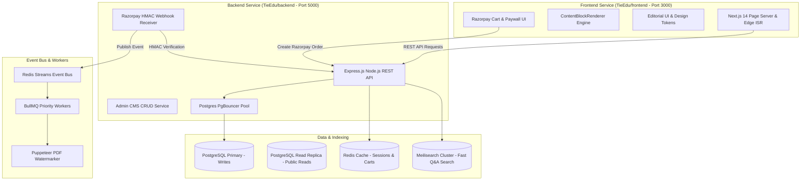

# TieEdu — Master System Design, Decoupled Architecture & Scale Blueprint (v2 Complete)

> **Core Platform Architecture & Positioning Thesis:**
> TieEdu is not a static question bank or a PDF collection. It is a high-performance **Company Interview Intelligence Platform** built as two fully decoupled, independently deployable services:
> 
> 1. **`TieEdu/frontend/`**: Next.js 14 TypeScript Web Application (Port 3000) providing the Stripe/Linear/Notion-grade editorial UI, Block Engine Renderer, Paywalls, Cart Checkout, and Admin CMS.
> 2. **`TieEdu/backend/`**: Express.js Node.js TypeScript REST API & Worker Cluster (Port 5000) managing PostgreSQL pools, Razorpay HMAC Webhook security, Admin CMS CRUD, BullMQ async queues, and Redis Streams event bus.
> 
> Adding company #5,000 requires **zero code changes or redeployments** — only content entry via the CMS API. The platform is explicitly engineered for **India's spiky placement season traffic (August–December)**, combining edge-cached Next.js ISR, Postgres read-replicas, PgBouncer connection pooling, and decoupled REST APIs.

---

## Table of Contents
1. [Decoupled System Architecture Overview](#1-decoupled-system-architecture-overview)
2. [Premium Positioning & Framing Strategy](#2-premium-positioning--framing-strategy)
3. [Monetization Model & Pricing Psychology](#3-monetization-model--pricing-psychology)
4. [Comprehensive Feature Specification](#4-comprehensive-feature-specification)
5. [UI/UX Design System — "Light, Professional, Editorial"](#5-uiux-design-system--light-professional-editorial)
6. [Core Content Engine & Block Payload Specification](#6-core-content-engine--block-payload-specification)
7. [Complete Production Database Schema](#7-complete-production-database-schema)
8. [Backend REST API Endpoints & Webhook Security](#8-backend-rest-api-endpoints--webhook-security)
9. [Scale Infrastructure & Placement Season Spike Strategy](#9-scale-infrastructure--placement-season-spike-strategy)
10. [Programmatic SEO & Growth Engine](#10-programmatic-seo--growth-engine)
11. [Trust, Security & Regulatory Compliance](#11-trust-security--regulatory-compliance)
12. [Phased Implementation Roadmap & Telemetry](#12-phased-implementation-roadmap--telemetry)

---

## 1. Decoupled System Architecture Overview

---

## 2. Premium Positioning & Framing Strategy

| Lever | Strategic Execution | Competitive Differentiator vs PDF/Coaching Sites |
|---|---|---|
| **Category Framing** | Positioned strictly as a **"Company Interview Intelligence Platform"** rather than a "question bank" or static PDF package. Focuses on verified candidate reports, historical trend data, and real-time freshness. | Shifts perceived value from a static commodity (PDF) to a living intelligence tool worth paying a subscription for. |
| **Scarcity & Exclusivity Cues** | Prominent micro-indicators on company hubs: *"Updated 3 days ago"*, *"127 candidates unlocked Zscaler this week"*, *"Last verified interview report: Sept 2026"*. | Freshness acts as the primary driver to convert candidates away from outdated pirated drives. |
| **Social Proof Density** | Every company landing view displays verified stats: total unlocks, average accuracy rating (% matching real interview), and verified candidate status badges. | Establishes immediate trust before asking for credit card information. |

---

## 3. Monetization Model & Pricing Psychology

- **Free Preview (₹0):** 2–3 preview Qs/company, daily challenge, community read-access.
- **Single Company Unlock (₹149–₹299):** Full vault for 1 company, lifetime access, watermarked PDF download.
- **Pro Subscription (₹499/mo or ₹1,199/qtr):** All-access to all 200+ companies, auto study plan, priority peer reviews.
- **Elite Placement Pass (₹1,999):** Season-long pass (August–December), priority support, early Q release access.
- **Campus / B2B:** Institutional seats for college placement cells with admin cohort dashboards.

---

## 4. Backend REST API Endpoints

- `GET /api/companies` — Fetch all published company vaults.
- `GET /api/companies/:slug` — Fetch round-by-round interview modules and block content for a target company.
- `POST /api/checkout/create-order` — Create Razorpay orders for single unlocks or Pro/Elite passes.
- `POST /api/webhooks/razorpay` — HMAC-SHA256 signature verification and idempotent transactional content unlock.
- `POST /api/reports` — Submit candidate post-interview reports to admin moderation queue.
- `GET /api/health` — Service health check.

---

## 5. UI/UX Design System Specification

- **Canvas & Surface:** Warm off-white `#FAFAF9`, pure white `#FFFFFF` cards, 1px subtle hairline border `#EDEDEB`.
- **Branding:** Deep Navy `#1F3A5F` primary authority color, Warm Amber `#E8A33D` reserved for high-intent CTAs.
- **Typography:** Serif (`Fraunces` / `Lora`) for H1/H2 hero headlines; clean Grotesk sans (`Inter`) for body text; `JetBrains Mono` for code.
- **Paywall Blur Overlay:** Frosted glass overlay (`backdrop-filter: blur(8px)`) with centered pill CTA.

---
*TieEdu Master System Design & Decoupled Blueprint v2 — Complete Edition*
